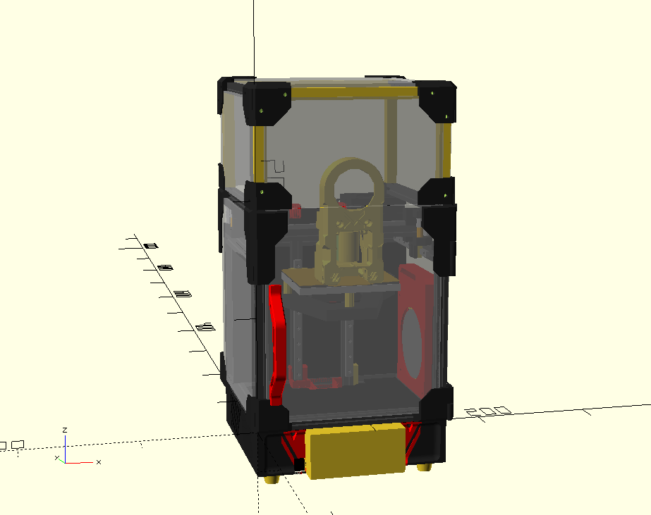

# Micro 0, a 1010 Makerbeam-based Voron 0 printer

This is an attempt at producing the smallest practically-sized Voron 0 style printer that could be made. This makes use of 10x10mm Makerbeam extrusions, in the standard 150mm lengths, alongside the typical NEMA14's of a Voron 0.

The current design makes use of a modified (Mailbox toolhead by chirpy2605)[https://github.com/chirpy2605/voron/tree/main/V0/Mailbox], and with the enclosure sealed has a print volume of 90x70x75mm. With the door and tophat removed, the rails should allow for 90x80x80mm of travel. Further work would need to be done on the toolhead to allow for this.

The external footprint of the printer is 179x179x338mm, including panel clips and a 100mm tophat.

## Project status: Beta/WIP

This is a very early work in progress. It is highly recommended to be extremely familiar with the V0 build process before starting. Expect to have to figure things out as you go, and refer to both the CAD and standard V0 manual as appropriate.

That said, any suggestions or improvements are welcome. All issues and pull requests will be looked at.

## Hardware/BOM

This printer requires mostly similar hardware to a standard V0, though many pieces are scaled down. Bolts are on a best-fit basis, and exact counts aren't known. Test what works, generally opting for the same, or slightly shorter than stock.

- The standard F623-RS flanged bearings are replaced by F683zz bearings (3x7x3mm). The standard bearings are too large in diameter and interfere with panels.
- The X and Y rails are replaced by (MGN5 rails)[https://www.aliexpress.com/item/1005004714467036.html]. The X must be 120mm, whilst the Y should both be 100mm. The Z rails are still MGN7H rails, but should be cut to 115-120mm in length.
- For the MGN5 rails, standard M2 bolts will not allow for the carriage to move. (These M2x6x3 screws)[https://www.robotdigg.com/product/1010/Slim-head-set-screws-for-linear-rails] from RobotDigg are confirmed suitable.
- Makerbeams require special M3 nuts that they sell in packs of 25. 3 packs (75 nuts) are sufficient, with some excess. 50 may work in a pinch, but some modifications to the design will be required.
- Makerbeams fit some standard hex M2 nuts. I used excess M2 nuts from a Formbot V0 kit, and found that around 5% of them would fit, whilst most were too large. Unfortunately, I do not know where to source M2 nuts that fit consistently.
- This design uses the standard 150mm extrusions sold by Makerbeam. These are sold in packs of 6. The main body uses 16, with a 100mm tophat requiring an additional 6. However, I've included printed parts to replace the front and back extrusion of the tophat, meaning the complete design can be made with 18 extrusions (3 packs of 6).

## Build Advice/Other Things to Consider

### Print orientation

Most pieces are not oriented correctly at all. For most pieces, following the orientation of the original V0 is fine. Please note that for the XY joint top pieces, supports are needed, since I have only cut standard cylinders for the bolt holes.

Perhaps most importantly, the panel clips need to be printed with supports on 45 degree angles. Printing the clips as per the V0 orientation will result in the clip-in part snapping easily. For strength, the layers need to stack along the length of the clip part. This unfortunately necessitates support material. Any better design suggestions that don't rely on excessive use of nuts would be greatly appreciated.

### Makerbeams

The 10x10 Makerbeams have a similar groove profile to 1515 extrusions. Importantly, clip-in pieces for 1515 extrusions should just fit, albeit a little tightly.

The depth of the channel is around 2.5mm from the outer face of the extrusion. M3 nuts are flush with the outer face, whilst M2 nuts would be recessed 1mm. 5mm bolts are best for the Z-axis, and most bolts should be 1-2mm shorter than the equivalent in a Voron 0.

### Electronics

The BOM power supply of the Voron 0, the LRS-150 is larger than the available space in this design. My build made use of an AC bed, and thus I used a (90W Mean Well power supply (MPM-90-24ST))[https://au.mouser.com/ProductDetail/MEAN-WELL/MPM-90-24ST?qs=GBLSl2AkirvRs6RUFVoFrA%3D%3D]. DC beds will obviously require a larger power supply, but there may exist other options than the LRS-150.

Although a full-sized Raspberry Pi should fit, a Pi Zero W or Zero 2W is highly recommended for ensuring more free space and air flow.

### Heated Bed

Most heat mats are too large for use with this bed. (Custom silicone heater pads)[https://www.aliexpress.com/item/1005005170757163.html] are around, but if you want a heated bed, it will not be as simple as buying a Voron preset heater.

According to the 0.4W/cm^2 rule, a 30W mat would be good, but I personally use a 15W mat (as that is all the seller offered), that is sufficient albeit a little slow to heat. If you can find a 30W heater, I would recommend it.

### Bed

The bed is custom sized. At present, there exists no supplier for them, so there are some DXFs included under "DXFs/bed" for cutting the bed out of a piece of 6mm or 1/4" aluminium using a CNC mill. For my build, screw holes were countersunk to 4mm depth with a flat end mill.

Also, (Energetic)[https://energetic3d.aliexpress.com/store/4542004] on Aliexpress do custom PEI plates, and I have found are very good.

### Auxiliary Cooling

A very simple auxiliary cooler based on a 7515 cooling fan is included. It's not a very good design, but functions well enough for my purposes. It can be included, removed, or modified as needed.

## Credits/Attribution

The following models included in this repository are taken from other places.
 - "Cowl_NoProbe.stl" and "Dragon_Mount.stl" by chirpy2605 on (Github)[https://github.com/chirpy2605/voron/tree/main/V0/Mailbox]. Used under GPL3.0.
 - "PrintedVoronFoot.stl" by stoneburner on (Printables.)[https://www.printables.com/model/633391-printed-voron-v02-foot] Used under public domain license terms.
 - The following models are taken from the (Voron 0 STLs)[https://github.com/VoronDesign/Voron-0/tree/Voron0.2r1/STLs]:
  - "[a]_Tensioner_Knob_x2.stl"
  - "[a]_Cable_Tie_x1.stl"
  - "[a]_B_Drive_Tensioner_x1.stl"
  - "[a]_A_Drive_Tensioner_x1.stl"
  - "[a]_9mm_Spacer_x6.stl"
  - "X_Carriage_x1.stl" (renamed to "carriage.stl")
 - "[a]_fan_grill_A_x2.stl" (renamed to "[a]_fan_grill.stl") by hartk from (Micron Github)[https://github.com/PrintersForAnts/Micron/blob/main/STLs/Skirts/SideFanSkirts/%5Ba%5D_fan_grill_A_x2.stl]. Used under GPL3.0.
